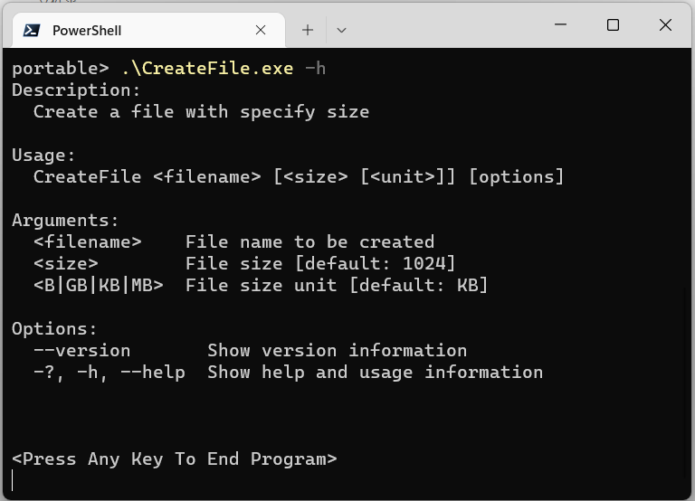
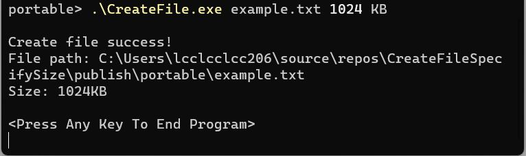
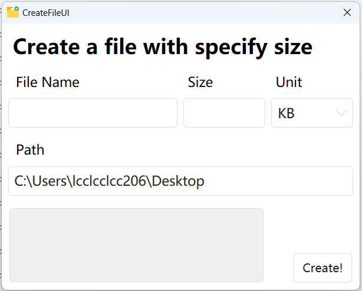
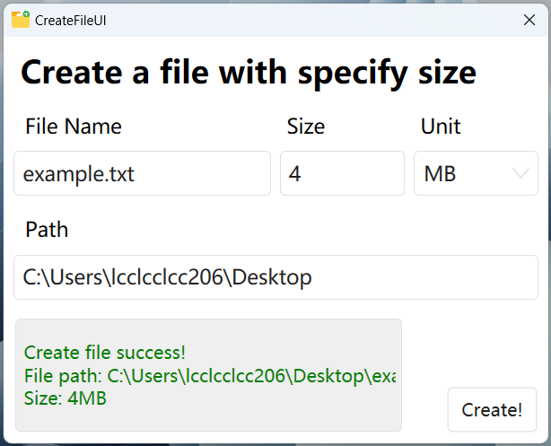

# CreateFileSpecifySize

一个可以帮助生成指定大小的文件的应用程序。

起初，我在测试局域网的网速时，常常需要花时间寻找文件或是搜索文件生成命令来获得一定大小的文件，来测试它传输的网速。因为这个功能本身比较简单，本着学习的态度编写了这个程序，希望你能喜欢。

这个项目包含了 CMD 和 UI 两个项目，对应着控制台程序和 带 UI 界面的程序，控制台的版本使用了 System.CommandLine 库来分析命令行，带界面的应用程序使用了 HandyOrg 的 HandyControl 控件库来美化界面，以下是对应链接：

[dotnet/command-line-api: Command line parsing, invocation, and rendering of terminal output. (github.com)](https://github.com/dotnet/command-line-api)

[HandyOrg/HandyControl: Contains some simple and commonly used WPF controls (github.com)](https://github.com/HandyOrg/HandyControl)

## Example

